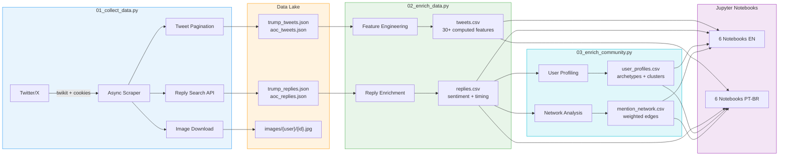
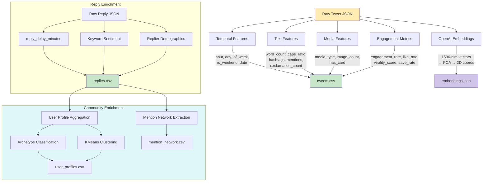
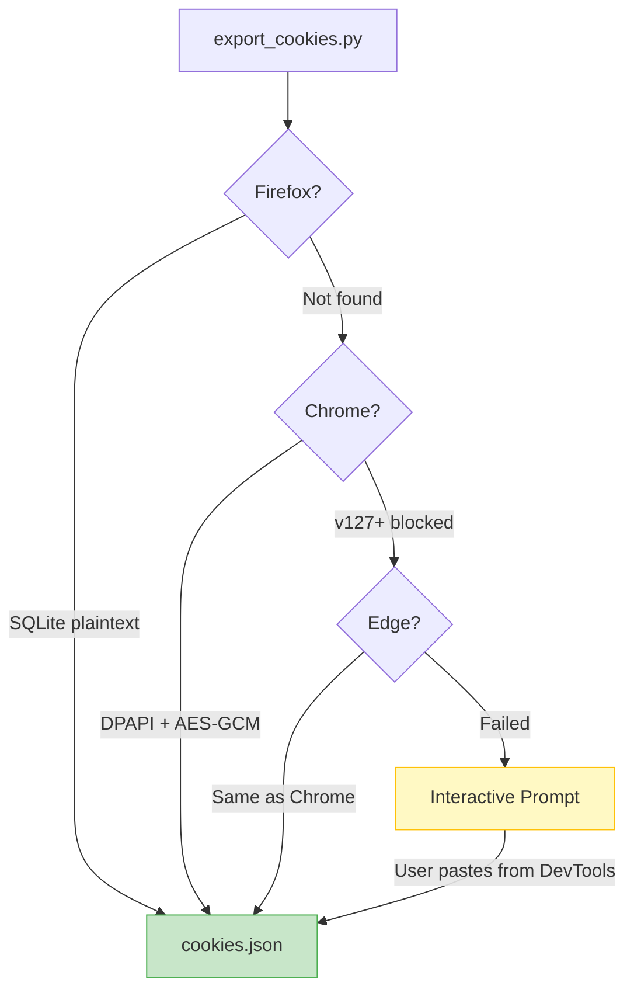

# Trump vs AOC: Netnographic Analysis of Political Communication on Twitter/X


A data science and NLP project that applies **netnographic research methodology** to analyze the digital communication strategies of Donald Trump and Alexandria Ocasio-Cortez on Twitter/X. The system collects 200 tweets (100 per politician), thousands of reply threads, and tweet images, then runs a full analytical pipeline including engagement analysis, content/discourse analysis, community response patterns, image analysis, and semantic embedding visualization.

> **Academic context**: Developed for U.S. History course (HIS832) at **UFOP (Universidade Federal de Ouro Preto)**, aimed at history students and teachers studying contemporary digital political discourse.

## Architecture

### Data Pipeline



### Feature Engineering Pipeline



## Technical Decisions

| Decision | Chosen | Alternatives Considered | Rationale |
|----------|--------|------------------------|-----------|
| **Twitter scraping** | twikit (cookie auth) | Tweepy, snscrape, twscrape | No official API keys needed; async; cookie persistence bypasses deprecated login endpoints |
| **Authentication** | Browser cookie extraction | Username/password login | Twitter deprecated login API (404 error); built custom Firefox SQLite + Chrome DPAPI + interactive fallback |
| **Reply collection** | `conversation_id` search | `get_tweet_by_id().replies` | twikit's reply parser broke due to API changes; search with `conversation_id:{id}` filter works reliably |
| **Embeddings** | OpenAI `text-embedding-3-small` | TF-IDF, sentence-transformers, Voyage AI | Best semantic quality for short text; negligible cost (~$0.001 for 200 tweets); cached after first run |
| **Dimensionality reduction** | PCA | t-SNE, UMAP | Deterministic with `random_state=42`; reproducible results; sufficient for 200-point visualization |
| **Sentiment analysis** | Keyword-based classifier | VADER, TextBlob, LLM-based | Zero dependencies; fully reproducible; transparent methodology (students can see the word lists) |
| **Image analysis** | Pillow (PIL) | OpenCV, torchvision | Lightweight; sufficient for brightness, color, and dimension analysis; no GPU needed |
| **Data format** | CSV (processed) + JSON (raw) | Parquet, SQLite | Human-readable; diffable for git; compatible with Pandas without extra drivers |
| **Bilingual output** | Separate notebook files + `set_language()` helper | Single notebook with language toggle | Cleaner separation; each version runs independently; `plot_helpers.py` provides label switching |

## Cookie Authentication Strategy

Twitter/X deprecated its login API in 2025 (Chrome v127+ App-Bound Encryption further complicated things). Our `export_cookies.py` implements a multi-layer fallback:



## Project Structure

```
trump-aoc-netnography/
├── 01_collect_data.py          # Async scraper: tweets + replies + images
├── 02_enrich_data.py           # Feature engineering: 30+ computed columns
├── 03_enrich_community.py      # Community profiling: archetypes, networks, clusters
├── export_cookies.py           # Multi-browser cookie extraction utility
├── config.py                   # Centralized constants, paths, color palette
├── data/
│   ├── raw/                    # Raw JSON (gitignored)
│   ├── images/                 # Downloaded tweet images (gitignored)
│   │   ├── trump/              # {tweet_id}_{index}.jpg
│   │   └── aoc/
│   ├── processed/              # Enriched CSV + embeddings (gitignored)
│   └── seed/                   # Fixed snapshot for reproducibility
├── notebooks/
│   ├── en/                     # English analysis (6 notebooks)
│   └── pt-br/                  # Portuguese translations (6 notebooks)
├── utils/
│   ├── data_loader.py          # Auto-resolves processed vs seed data
│   ├── plot_helpers.py         # Matplotlib styling + EN/PT-BR label switching
│   └── text_helpers.py         # Hashtag/mention extraction, sentiment, stopwords
├── requirements.txt
├── .env.example
└── .gitignore
```

## Analysis Notebooks

| # | Notebook | Focus | Key Techniques |
|---|----------|-------|----------------|
| 1 | **Exploratory Analysis** | Temporal patterns, posting rhythms, content formats | Time series, heatmaps, stacked bars |
| 2 | **Engagement Analysis** | Likes, retweets, virality, engagement rates | Box plots, scatter plots, engagement rate normalization |
| 3 | **Content & Discourse** | Word frequency, hashtags, topics, **2D tweet map** | NLP, keyword classification, **OpenAI embeddings + PCA** |
| 4 | **Community Response** | Reply threads, sentiment, replier demographics | Sentiment analysis, timing analysis, demographic profiling |
| 5 | **Visual Analysis** | Image properties, color palettes, visual rhetoric | PIL brightness/color extraction, engagement correlation |
| 6 | **Deep Community Analysis** | Network topology, user archetypes, echo chambers, longitudinal behavior | NetworkX graphs, PageRank centrality, KMeans clustering, archetype classification |

All notebooks are written in **accessible language** for history students (no statistical jargon without explanation) and include "What does this tell us?" interpretation cells after every chart.

## Skills Demonstrated

- **Web Scraping**: Async Python with `twikit`, cookie-based authentication, rate limiting with exponential backoff, partial-save on interrupt
- **ETL Pipeline**: Data lake (raw JSON) → Data warehouse (enriched CSV) pattern with validation assertions
- **NLP**: OpenAI embeddings (`text-embedding-3-small`), PCA dimensionality reduction, keyword extraction, keyword-based sentiment classification
- **Network Analysis**: NetworkX graph construction, PageRank centrality, community detection, mention network mapping
- **Data Visualization**: 50+ Matplotlib charts with consistent styling, bilingual label system, professional formatting
- **Image Analysis**: Pillow-based brightness, color channel, and dimension analysis of tweet images
- **Browser Engineering**: Cross-browser cookie extraction (Firefox SQLite, Chrome DPAPI/AES-GCM, Edge, interactive fallback)
- **Reproducibility**: Seed data snapshots, `random_state=42` everywhere, cached embeddings, deterministic enrichment
- **Bilingual Delivery**: Full EN/PT-BR notebook suite with `set_language()` abstraction in plotting utilities
- **Research Methodology**: Kozinets' netnography framework applied to contemporary political communication

## Setup

### Prerequisites

- Python 3.10+
- A Twitter/X account (logged in via browser)
- OpenAI API key (for embeddings — ~$0.001 cost for 200 tweets)

### Installation

```bash
git clone https://github.com/ayrtondenner/trump-aoc-netnography.git
cd trump-aoc-netnography
python -m venv venv
source venv/bin/activate  # Linux/Mac
# or: venv\Scripts\activate  # Windows
pip install -r requirements.txt
```

### Configuration

```bash
cp .env.example .env
# Edit .env with your credentials:
#   TWITTER_USERNAME, TWITTER_EMAIL, TWITTER_PASSWORD
#   OPENAI_API_KEY
```

## Usage

```bash
# Step 1: Export browser cookies (log into x.com first, then close browser)
python export_cookies.py

# Step 2: Collect tweets, replies, and images
python 01_collect_data.py

# Step 3: Enrich raw data into analysis-ready CSVs
python 02_enrich_data.py

# Step 4: Build community profiles, networks, and archetypes
python 03_enrich_community.py

# Step 5: Open analysis notebooks
jupyter notebook notebooks/en/   # English
jupyter notebook notebooks/pt-br/  # Portuguese
```

### Re-running the Pipeline Later

If you need to collect fresh data (e.g., newer tweets), follow these steps:

```bash
# 1. Activate the virtual environment
cd C:\Users\Ayrton\trump-aoc-netnography
venv\Scripts\activate           # Windows
# source venv/bin/activate      # Linux/Mac

# 2. Re-export cookies (Twitter cookies expire periodically)
#    Log into x.com in your browser first, then close it
python export_cookies.py

# 3. Re-collect data (overwrites data/raw/)
python 01_collect_data.py
#    Note: This takes ~2-3 hours due to Twitter rate limiting
#    Progress is saved every 10 tweets — safe to interrupt with Ctrl+C

# 4. Re-enrich the data (overwrites data/processed/)
python 02_enrich_data.py

# 5. Re-build community profiles and networks
python 03_enrich_community.py

# 6. Run notebooks (embeddings will be regenerated on first run of notebook 03)
jupyter notebook notebooks/en/

# To run all notebooks non-interactively (verify they execute without errors):
jupyter nbconvert --to notebook --execute notebooks/en/01_exploratory_analysis.ipynb
jupyter nbconvert --to notebook --execute notebooks/en/02_engagement_analysis.ipynb
jupyter nbconvert --to notebook --execute notebooks/en/03_content_analysis.ipynb
jupyter nbconvert --to notebook --execute notebooks/en/04_comments_analysis.ipynb
jupyter nbconvert --to notebook --execute notebooks/en/05_visual_analysis.ipynb
jupyter nbconvert --to notebook --execute notebooks/en/06_community_deep_analysis.ipynb
```

**Common issues when re-running:**
- **`cookies.json` expired**: Re-run `python export_cookies.py` (log into x.com in Firefox first)
- **Rate limiting**: The collection script handles this automatically with 60s waits, but very heavy usage may require waiting a few hours
- **OpenAI embeddings**: Cached in `data/processed/embeddings.json`. Delete this file to regenerate with fresh data

### Using Seed Data

If `data/seed/` contains a snapshot, notebooks auto-detect and use it when `data/processed/` is absent. This enables reproducibility without re-collecting data.

To create a seed snapshot from current data:
```bash
cp data/raw/*.json data/seed/
cp data/processed/*.csv data/seed/
cp -r data/images/* data/seed/images/
```

## Tech Stack

| Layer | Technology | Purpose |
|-------|-----------|---------|
| Scraping | twikit, httpx, asyncio | Tweet/reply collection, image download |
| Cookie Auth | sqlite3, ctypes (DPAPI), cryptography | Cross-browser cookie extraction |
| Processing | Pandas, NumPy | Data transformation, feature engineering |
| NLP | OpenAI API, scikit-learn | Embeddings, PCA, text vectorization |
| Network Analysis | NetworkX | Graph construction, PageRank, community detection |
| Visualization | Matplotlib | 50+ charts, bilingual labels |
| Image Analysis | Pillow (PIL) | Brightness, color, dimensions |
| Environment | python-dotenv, tqdm | Config management, progress bars |
| Notebooks | Jupyter, ipykernel | Interactive analysis |

## Reproducibility

- `random_state=42` for all stochastic operations (PCA, sampling)
- OpenAI embeddings cached to `data/processed/embeddings.json` after first generation
- All enrichment transformations in `02_enrich_data.py` are deterministic
- Seed data snapshots enable exact reproduction of analysis results
- Bilingual notebooks share identical computation logic — only display strings differ

## References

### Netnography & Methodology

- Kozinets, R. V. (2015). *Netnography: Redefined* (2nd ed.). SAGE Publications.
- Kozinets, R. V. (2020). *Netnography: The Essential Guide to Qualitative Social Media Research* (3rd ed.). SAGE Publications. [(SAGE)](https://uk.sagepub.com/en-gb/eur/netnography/book260905)
- Rheingold, H. (2000). *The Virtual Community: Homesteading on the Electronic Frontier* (Revised ed.). MIT Press. [(MIT Press)](https://direct.mit.edu/books/book/2147/The-Virtual-CommunityHomesteading-on-the)

### Political Communication on Social Media (English)

- Barberá, P. (2015). Birds of the Same Feather Tweet Together: Bayesian Ideal Point Estimation Using Twitter Data. *Political Analysis*, 23(1), 76–91. [(DOI)](https://doi.org/10.1093/pan/mpu011)
- Jungherr, A. (2016). Twitter Use in Election Campaigns: A Systematic Literature Review. *Journal of Information Technology & Politics*, 13(1), 72–91. [(DOI)](https://doi.org/10.1080/19331681.2015.1132401)
- Bode, L., & Dalrymple, K. E. (2016). Politics in 140 Characters or Less: Campaign Communication, Network Interaction, and Political Participation on Twitter. *Journal of Political Marketing*, 15(4), 311–332. [(DOI)](https://doi.org/10.1080/15377857.2014.959686)

### Sentiment Analysis & Digital Discourse

- Liu, B. (2015). *Sentiment Analysis: Mining Opinions, Sentiments, and Emotions*. Cambridge University Press. [(Cambridge)](https://www.cambridge.org/core/books/sentiment-analysis/3F0F24BE12E66764ACE8F179BCDA42E9)

### Netnografia e Comunicação Política (Português)

- Amaral, A., Natal, G., & Viana, L. (2008). Netnografia como aporte metodológico da pesquisa em comunicação digital. *Sessões do Imaginário*, (20), 34–40. [(PUC-RS)](https://revistaseletronicas.pucrs.br/famecos/article/view/4829)
- Recuero, R. (2009). *Redes Sociais na Internet*. Sulina. [(PDF)](http://www.raquelrecuero.com/livros/redes_sociais_na_internet.pdf)
- Recuero, R. (2014). *A Conversação em Rede: Comunicação Mediada pelo Computador e Redes Sociais na Internet* (2ª ed.). Sulina. [(Editora Sulina)](https://www.editorasulina.com.br/detalhes.php?id=574)
- Ituassu, A., & Lifschitz, S. (2015). Temas e Mídia em #Eleições2014: Twitter, opinião pública e comunicação política no contexto eleitoral brasileiro. *E-Compós*, 18(2), 1–19. [(DOI)](https://doi.org/10.30962/ec.1196)
- Recuero, R., Zago, G., & Soares, F. (2017). Mídia Social e Filtros-Bolha nas Conversações Políticas no Twitter. *Anais do XXVI Encontro Anual da Compós*. [(Compós)](https://proceedings.science/compos/compos-2017/trabalhos/midia-social-e-filtros-bolha-nas-conversacoes-politicas-no-twitter?lang=pt-br)

### Original Study

- [AOC-vs-Trump-Twitter-Analysis](https://github.com/ayrtondenner/AOC-vs-Trump-Twitter-Analysis)

## License

This project is for academic and educational purposes.
